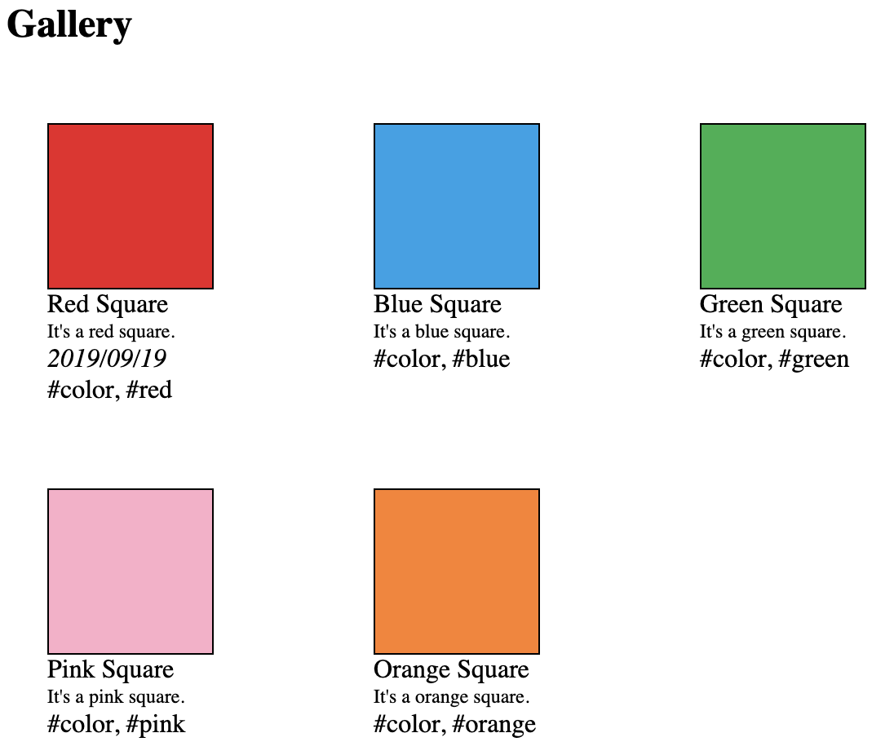

# imagedb

Library for loading and querying a set of images, with convenience methods for arranging the images in a simple,
stylable HTML template.

## Example



```json
[
  {
    "path": "images/red.jpg",
    "title": "Red Square",
    "description": "It's a red square.",
    "tags": ["color", "red"],
    "creationDate": "2019/09/19"
  },
  {
    "path": "images/blue.jpg",
    "title": "Blue Square",
    "description": "It's a blue square.",
    "tags": ["color", "blue"]
  },
  {
    "path": "images/green.jpg",
    "title": "Green Square",
    "description": "It's a green square.",
    "tags": ["color", "green"]
  },
  {
    "path": "images/pink.jpg",
    "title": "Pink Square",
    "description": "It's a pink square.",
    "tags": ["color", "pink"]
  },
  {
    "path": "images/orange.jpg",
    "title": "Orange Square",
    "description": "It's a orange square.",
    "tags": ["color", "orange"]
  }
]
```

See [example](./example) folder for the HTML/CSS/JS.

## Development

`pnpm install` -- install dependencies

`npm run build` -- build. Outputs to the `dist/` directory
